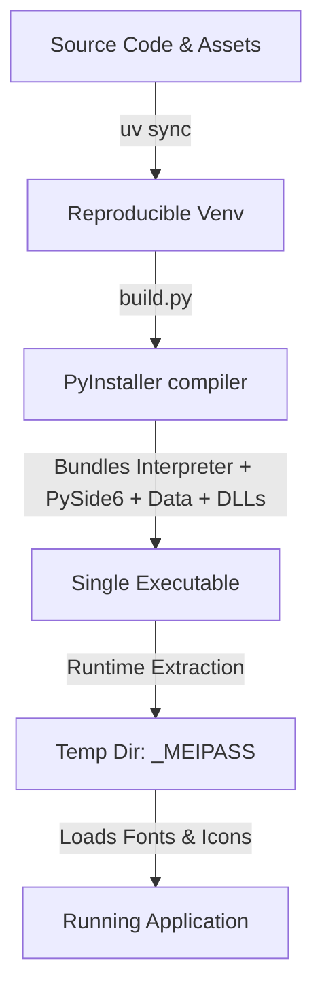

# Kira Shipping & Packaging Guide (Closed Beta)

This document describes how to build, package, and ship the Kira application as a single-file executable for Windows, macOS, and Linux. 

To prepare for our closed beta, we use **`uv`** for lightning-fast, reproducible dependency management and **PyInstaller** to compile the codebase into native binaries. Our automated **CI/CD pipeline (GitHub Actions)** manages multi-platform compilation, ensuring that every build is clean, isolated, and uniform.

---

## 1. Core Architecture

Packaging a Python-based PySide6 application with heavy data packages (`numpy`, `pandas`, `scipy`) into a single-file executable requires addressing three technical challenges:



1. **Deterministic Dependency Resolution**: We use a `pyproject.toml` with `uv.lock` to specify exact dependency pins. This eliminates "works on my machine" issues across developer systems and CI/CD runners.
2. **Frozen Runtime Environment**: When PyInstaller bundles the app into a single executable, the Python interpreter is frozen. At runtime, the application unpacks its modules and assets to a temporary directory (`sys._MEIPASS`). The application must dynamically resolve asset paths to this directory rather than using paths relative to raw source files.
3. **OS-Specific Formatting**: 
   - **Windows**: Bundled as a `.exe` executable. Uses `--noconsole` to suppress terminal spawn.
   - **macOS**: Bundled as an `.app` bundle, which can be zipped. Requires proper plist metadata.
   - **Linux**: Bundled as an ELF executable.

---

## 2. Reproducible Environment via `uv`

`uv` is an ultra-fast, Rust-powered Python package manager that replaces `pip`, `pip-tools`, and `virtualenv`.

### 2.1 Installing `uv`

On developers' local machines, install `uv` using the official installers:

* **Windows (PowerShell)**:
  ```powershell
  powershell -ExecutionPolicy ByPass -c "irm https://astral.sh/uv/install.ps1 | iex"
  ```
* **macOS and Linux (bash)**:
  ```bash
  curl -LsSf https://astral.sh/uv/install.sh | sh
  ```
* **Alternative (via pip)**:
  ```bash
  pip install uv
  ```

### 2.2 Environment Configuration: `pyproject.toml`

We define our project metadata, application dependencies, and development dependencies using a standardized PEP 621 `pyproject.toml`:

```toml
[project]
name = "kira"
version = "0.1.0"
description = "Kira - Event Sourced Data DSL and Reactive GUI"
readme = "readme.md"
requires-python = ">=3.10"
dependencies = [
    "PySide6>=6.6.0",
    "numpy>=1.22.0",
    "pandas>=1.4.0",
    "scipy>=1.8.0",
]

[dependency-groups]
dev = [
    "pyinstaller>=6.4.0",
    "pytest>=7.4.0",
]
```

### 2.3 Managing the Environment

* **Synchronizing the environment**:
  Run this command to automatically create a virtual environment (`.venv`) and install all production and development dependencies matching `pyproject.toml`:
  ```bash
  uv sync
  ```
  This generates/updates `uv.lock`, locking every nested dependency down to its exact cryptographic hash.

* **Running the Application**:
  Use `uv run` to execute commands inside the synced virtual environment without manually activating it:
  ```bash
  uv run run_gui.py
  ```

* **Adding or Updating Dependencies**:
  To add a new library (e.g., `requests`):
  ```bash
  uv add requests
  ```
  To add a development-only dependency:
  ```bash
  uv add --dev black
  ```

---

## 3. Dynamic Asset Resolution

When packaged as a single-file executable, your program's raw assets (fonts, icons) are extracted to a dynamic temporary folder at runtime, represented by `sys._MEIPASS`. 

If your code tries to load files using raw relative paths like `os.path.join(os.path.dirname(__file__), '..', 'icons')`, it will fail because the working directory in a packaged application is different.

We must ensure our code detects if it is running in a **frozen** state, resolving paths to `sys._MEIPASS` when compiled, and fallback to normal path resolution during active local development:

```python
import sys
import os

def resolve_resource_path(relative_path: str) -> str:
    """
    Resolves resource paths dynamically for both development and frozen execution.
    """
    if getattr(sys, 'frozen', False) and hasattr(sys, '_MEIPASS'):
        # PyInstaller temporary extraction folder
        return os.path.join(sys._MEIPASS, relative_path)
    
    # Local fallback: assume path is relative to the project root
    return os.path.abspath(os.path.join(os.path.dirname(__file__), "..", relative_path))
```

This utility ensures that asset loading is robust and fully transparent under both local development and frozen packaging.

---

## 4. The Cross-Platform Build Script (`build.py`)

To abstract the complexities of PyInstaller flags, we provide a unified Python build script: `build.py`. 

This script:
1. Auto-detects the host operating system.
2. Validates that the active virtual environment contains PyInstaller.
3. Packages static assets (`gui/icons` and `gui/font`) using the correct OS path separators (`;` on Windows, `:` on Unix).
4. Configures appropriate graphical options (e.g., `--noconsole` to hide command prompt windows on Windows/macOS).
5. Compiles the application into the `dist/` directory.

### Running the Build Script Locally

Simply run:
```bash
uv run build.py
```
This generates the packaged executable inside the `dist/` folder:
- **Windows**: `dist/Kira.exe`
- **macOS**: `dist/Kira.app` (application bundle)
- **Linux**: `dist/Kira` (ELF executable)

---

## 5. CI/CD Automated Pipelines

For high reproducibility, we automate binary generation via GitHub Actions. Every release or push to main will automatically trigger a clean build on physical Windows, macOS, and Linux runners in the cloud.

The workflow uses `astral-sh/setup-uv` which initializes `uv`, leverages its high-speed caching for packages, executes tests, compiles the binaries via `build.py`, and uploads the final output binaries.

### Workflow Configuration (`.github/workflows/build_binaries.yml`)

```yaml
name: Build and Ship Binaries

on:
  push:
    branches: [ main ]
    tags: [ 'v*' ]
  pull_request:
    branches: [ main ]

jobs:
  test:
    name: Run Verification Suite
    runs-on: ubuntu-latest
    steps:
      - name: Checkout Source Code
        uses: actions/checkout@v4

      - name: Install uv
        uses: astral-sh/setup-uv@v3
        with:
          enable-cache: true

      - name: Setup Python
        uses: actions/setup-python@v5
        with:
          python-version: '3.10'

      - name: Sync Dependencies
        run: uv sync

      - name: Run Test Suite
        run: uv run run_tests.py

  build:
    name: Compile Binaries (${{ matrix.os }})
    needs: test
    runs-on: ${{ matrix.os }}
    strategy:
      matrix:
        include:
          - os: windows-latest
            artifact_name: Kira-Windows.exe
            output_path: dist/Kira.exe
          - os: macos-latest
            artifact_name: Kira-macOS.app
            output_path: dist/Kira.app
          - os: ubuntu-latest
            artifact_name: Kira-Linux
            output_path: dist/Kira

    steps:
      - name: Checkout Source Code
        uses: actions/checkout@v4

      - name: Install uv
        uses: astral-sh/setup-uv@v3
        with:
          enable-cache: true

      - name: Setup Python
        uses: actions/setup-python@v5
        with:
          python-version: '3.10'

      - name: Sync Dependencies
        run: uv sync

      - name: Run Build Script
        run: uv run build.py

      - name: Upload Binary Artifact
        uses: actions/upload-artifact@v4
        with:
          name: ${{ matrix.artifact_name }}
          path: ${{ matrix.output_path }}
          if-no-files-found: error

  release:
    name: Publish Draft Release
    needs: build
    if: startsWith(github.ref, 'refs/tags/v')
    runs-on: ubuntu-latest
    steps:
      - name: Download Windows Binary
        uses: actions/download-artifact@v4
        with:
          name: Kira-Windows.exe
          path: release-assets/

      - name: Download macOS App Bundle
        uses: actions/download-artifact@v4
        with:
          name: Kira-macOS.app
          path: release-assets/Kira-macOS.app/

      - name: Download Linux Binary
        uses: actions/download-artifact@v4
        with:
          name: Kira-Linux
          path: release-assets/

      - name: Zip macOS App Bundle
        run: |
          cd release-assets
          zip -r Kira-macOS.zip Kira-macOS.app

      - name: Create Release
        uses: softprops/action-gh-release@v2
        with:
          files: |
            release-assets/Kira-Windows.exe
            release-assets/Kira-macOS.zip
            release-assets/Kira-Linux
          draft: true
          prerelease: true
        env:
          GITHUB_TOKEN: ${{ secrets.GITHUB_TOKEN }}
```

---

## 6. Verification and Troubleshooting

### 6.1 Testing the Binary

To verify the binary built locally or downloaded from CI:
1. Copy the executable outside of the project folder (e.g., to your Desktop) to ensure it does not load local source files.
2. Run the executable.
3. Verify that the UI renders, fonts load correctly (Inter, JetBrains Mono), and icons display sharp vector shapes.
4. Open the REPL panel and run a basic expression (e.g., `x = 5`, then `x + 10`) to verify the background evaluation daemon thread behaves as expected.

### 6.2 Common Issues & Resolutions

* **Issue**: The application immediately crashes on launch on Windows with no terminal showing.
  * **Fix**: Compile the binary in CLI-mode temporarily by modifying `build.py` to omit `--noconsole` (or run it via a terminal). This lets you see the Python tracebacks and missing modules.
  
* **Issue**: Missing DLLs or C Runtime library warnings (especially on clean Windows systems).
  * **Fix**: PyInstaller automatically collects standard runtime libraries. If a user is missing them, they should install the *Microsoft Visual C++ Redistributable*.
  
* **Issue**: Icons appear empty or fonts fall back to browser defaults.
  * **Fix**: Ensure that the resources paths were bundled correctly via `--add-data` and that `resolve_resource_path()` was used instead of raw relative paths in resource loader files.
